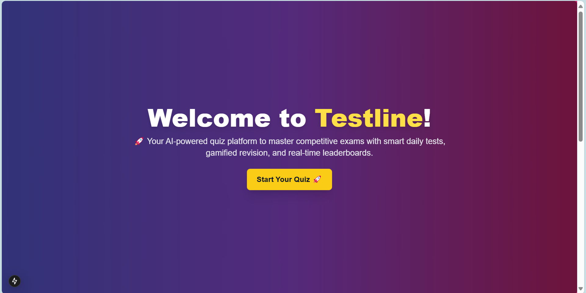
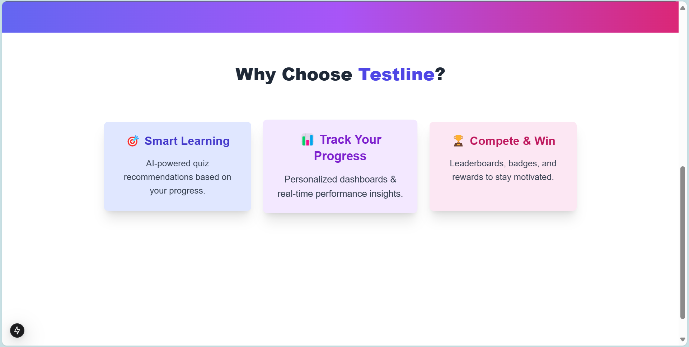
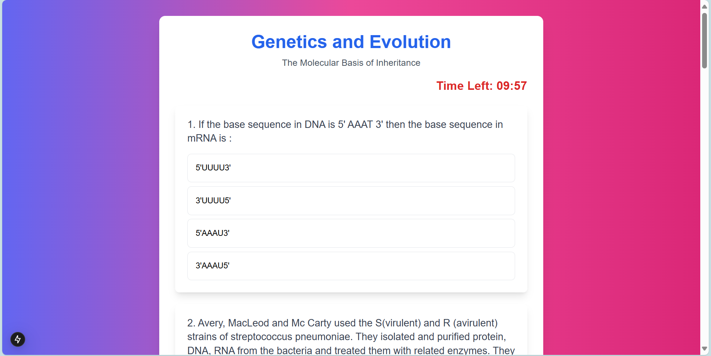
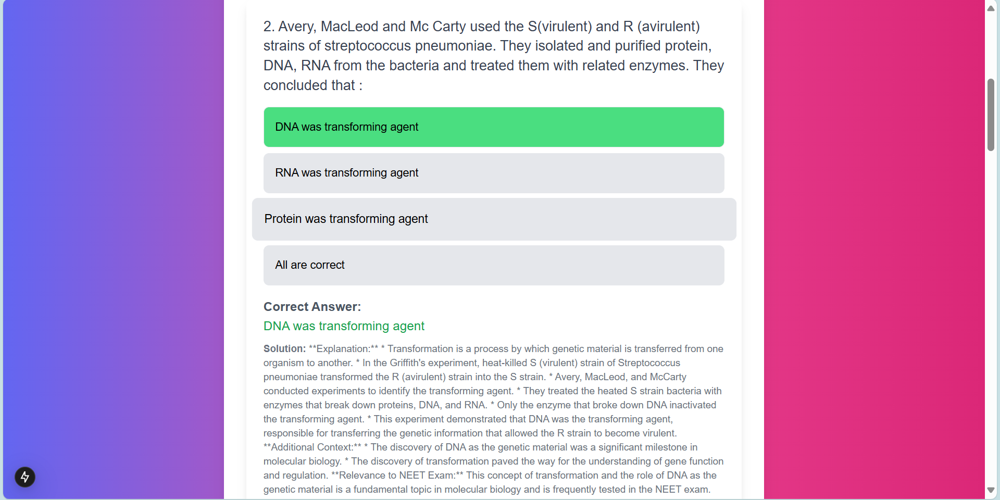
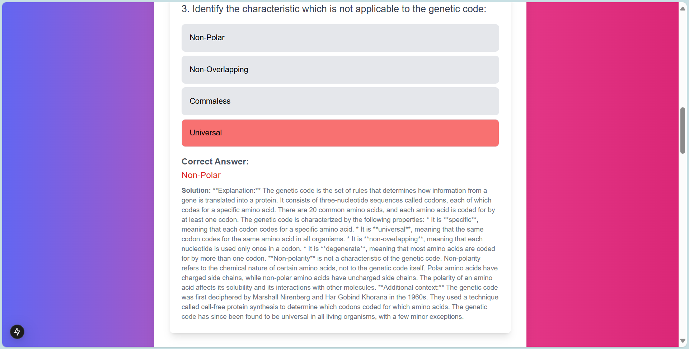
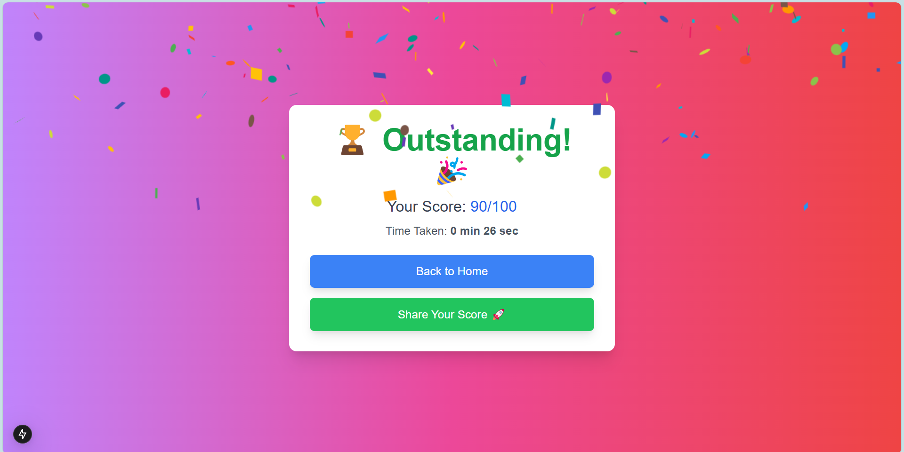
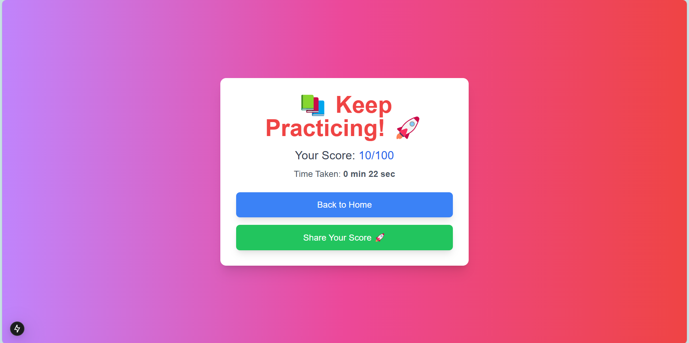

# 📚 Testline - Quiz App

🚀 **Project Overview**

This is an interactive quiz application built with Next.js. The app allows users to take quizzes, track their scores, and view results with a performance breakdown. With a modern UI, animations, and gamification features, the app enhances the user experience and engagement.

---

## 🎯 Features

✅ **Intuitive Quiz Interface** – A clean and engaging UI with smooth animations using Framer Motion.

✅ **Dynamic Questions** – Questions are fetched dynamically from an API endpoint.

✅ **Timer-Based Quiz** – Users have a countdown timer to complete the quiz.

✅ **Answer Selection with Feedback** – Users receive instant solution or feedback on their selected answers.

✅ **Performance Analysis** – Users can view their score and time taken after the quiz.

✅ **Confetti Animation for High Scores** – Celebrate achievements with animated effects.

🛠️ **Leaderboard and Sharing (Upcoming)** – Future enhancements for sharing scores and ranking system.

---

## 🛠️ Tech Stack

- **Next.js** – Framework for server-side rendering and optimized performance.
- **React & Framer Motion** – For interactive UI and animations.
- **Tailwind CSS** – For responsive and modern styling.
- **API Fetching** – Fetch quiz questions dynamically from an API.
- **Confetti Effect** – Celebration effect for high scorers using `react-confetti`.

---

## 📦 Installation & Setup

### Clone the repository:

```bash
git clone https://github.com/mananx01/testline-quiz-app.git
cd testline-quiz-app
```

### Install dependencies:

```bash
npm install
```
### Install Additional dependencies
```bash 
npm install framer-motion react-confetti
```

### Run the development server:

```bash
npm run dev
```

Open the app in the browser at **[http://localhost:3000](http://localhost:3000)**

---

## 📌 Project Structure

```
📂 src/app
 ├── 📄 page.jsx           # Home Page with quiz start option
 ├── 📂 quiz
 │   ├── 📄 page.jsx       # Quiz Page with questions and timer
 ├── 📂 results
 │   ├── 📄 page.jsx       # Results Page displaying score & analysis
 ├── 📂 api
 │   ├── 📄 route.js      # API route to fetch quiz data
📂 _components
 ├── 📄 quizbox.jsx       # Animated quiz start component
```

--- 

## 📷 Screenshots

### Landing Page1


### Landing Page2


### Quiz Page


### Correct Answer 


### Wrong Answer and its Explanation


### Great Score Result Page with Confetti 


### Less Score Results Page


---


## ✨ Developed by **Manan Upmanyu** 🚀